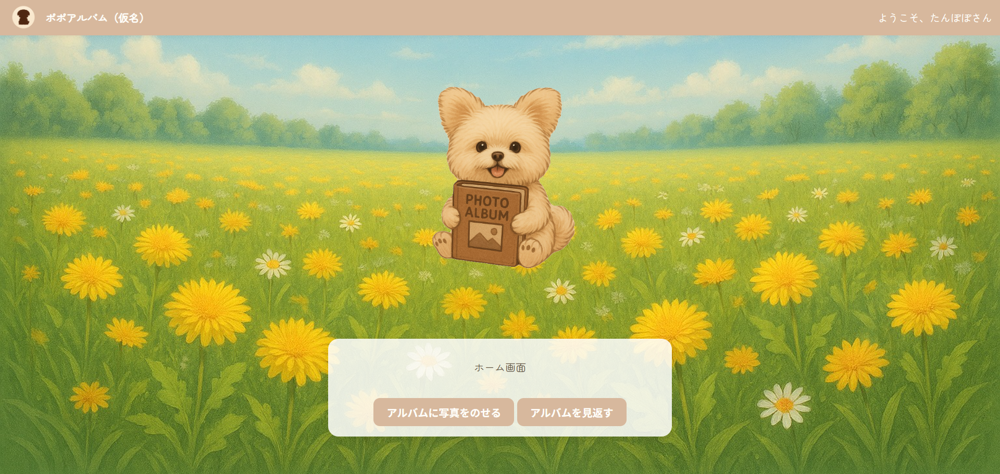

# Popo Album

個人学習用のSpring Boot Webアプリ。  
投稿した写真に対してAIがコメントします。  
現在、投稿・閲覧機能とログイン認証（Spring Security）は実装済み。  
外部API連携（Vision API / Gemini API）やAWSデプロイは開発予定です。

<h2>スクリーンショット</h2>

  

---

## 現在の機能

- ユーザー登録・ログイン（Spring Security導入済み）  
- 写真投稿・一覧閲覧  
- 投稿ごとのAIコメント（ダミーデータで表示）

---

## 今後の実装予定

- 外部API連携  
  - Google Vision APIで画像解析  
  - Gemini APIでコメント生成  
- AWSへのデプロイ（EC2 + S3）  
- タイムライン機能・いいね機能などの拡張

---

<h2>🚀使用技術</h2>

<h3>🖥️ フロントエンド</h3>
• Thymeleaf  
• HTML / CSS 

<h3>🧠 バックエンド</h3>
• Java 17 
• Spring Boot 3.2.0 
• Spring Security 
• Spring MVC 
• Spring Data JPA 

<h3>💾 データベース</h3>
• PostgreSQL 

<h3>🧰 その他</h3>
• Maven（ビルドツール） 
• Git / GitHub（バージョン管理） 

<h3>📚外部API連携</h3>
• Gemini API 
• Vision API 

<h2>設計🔨</h2>
 

作りかけ