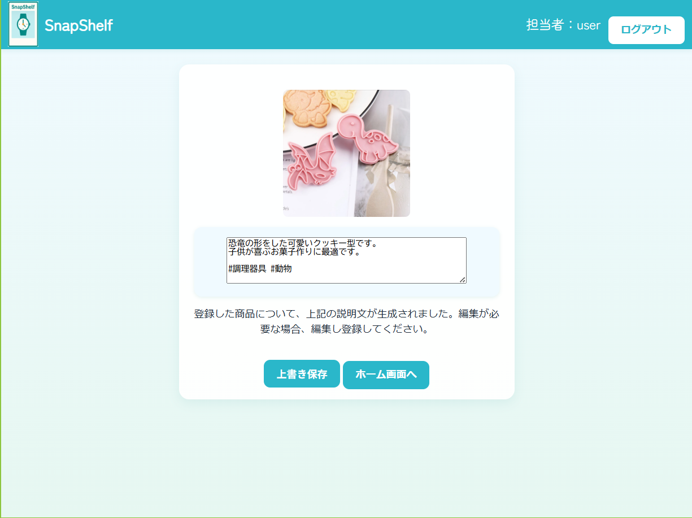

# SnapShelf 📸✨
**AI-powered Smart Product Management System**

> 商品画像をアップロードするだけで、AIが自動でタグ抽出と説明文を生成する次世代商品管理アプリ

## 🚀 Features

### ✅ 実装済み機能
- 📷 **商品画像アップロード** - 直感的な画像登録システム
- 👤 **ユーザー認証** - Spring Security による安全なログイン
- 📝 **商品管理** - 登録・一覧表示・編集機能
-🎨 **レスポンシブUI** - Thymeleaf + 部分的に Vue.js を利用したインタラクティブUI
- ⚡ **リアルタイム編集** - AI生成説明文のリアルタイム編集

### 🚧 開発予定機能
- 🤖 **AI画像解析** - Google Vision API による自動タグ抽出
- 📖 **AI説明文生成** - Gemini API による商品説明自動生成
- ☁️ **AWSデプロイ** - EC2 + S3 による本格運用
- ⭐ **お気に入り機能** - ユーザーの商品お気に入り管理
- 💬 **レビューシステム** - 商品レビュー・評価機能

## 🛠 Tech Stack

### Backend
- **Spring Boot 3.2.0** - モダンなJavaフレームワーク
- **Spring Security** - 認証・認可システム
- **Spring Data JPA** - データベースアクセス層
- **MySQL** - リレーショナルデータベース

### Frontend  
- **Thymeleaf** - サーバーサイドテンプレート（メイン）
- **Vue.js 2** - 部分的なインタラクティブ機能
- **Axios** - 非同期通信ライブラリ
- **HTML/CSS** - レスポンシブデザイン

### AI & External APIs
- **Google Vision API** - 画像解析・タグ抽出（予定）
- **Google Gemini API** - 自然言語生成（予定）

### Infrastructure（予定）
- **AWS EC2** - アプリケーションサーバー
- **AWS S3** - 画像ストレージ

## 🖥 Screenshots

### メイン画面
準備中

### 商品登録画面
準備中

### AI説明文編集

