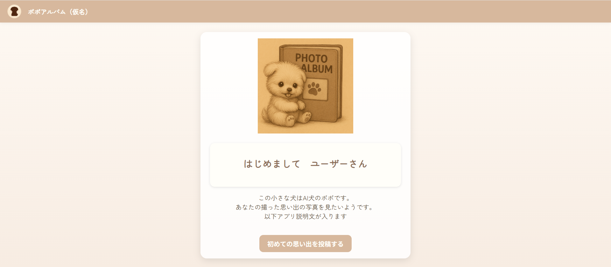
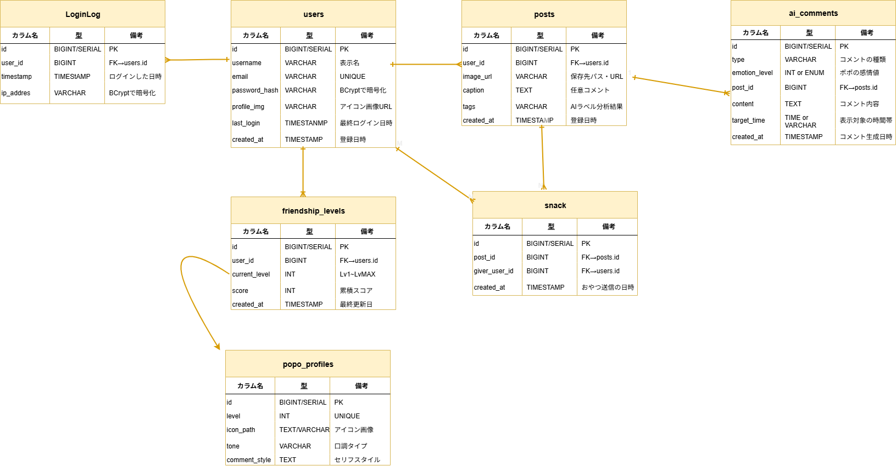
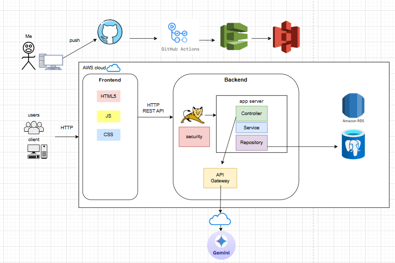

<h1>AIポポとのアルバムづくりアプリ</h1>
　 
投稿した写真に対してポポがコメント  
毎日の投稿で親密度アップ、ポポが成長 

<h2>📷スクリーンショット</h2>

<h2>🚀使用技術</h2>

<h3>🖥️ フロントエンド</h3>
• Thymeleaf  
• HTML / CSS 

<h3>🧠 バックエンド</h3>
• Java 17 
• Spring Boot 3.2.0 
• Spring Security 
• Spring MVC 
• Spring Data JPA 

<h3>💾 データベース</h3>
• PostgreSQL 

<h3>🧰 その他</h3>
• Maven（ビルドツール） 
• Git / GitHub（バージョン管理） 

<h3>📚外部API連携</h3>
• Gemini API 
• Vision API 

<h2>設計🔨</h2>
 

作りかけ