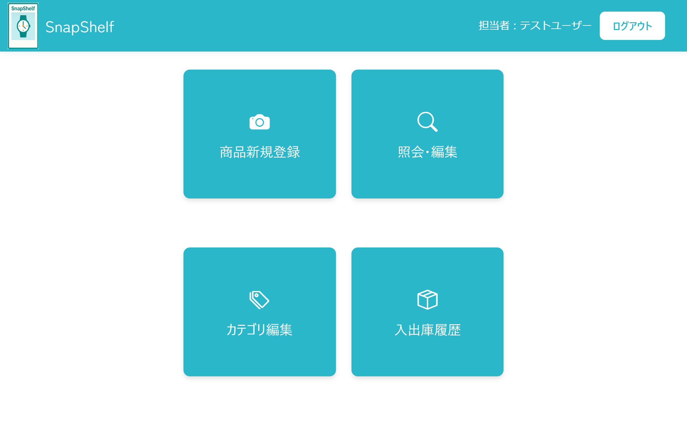
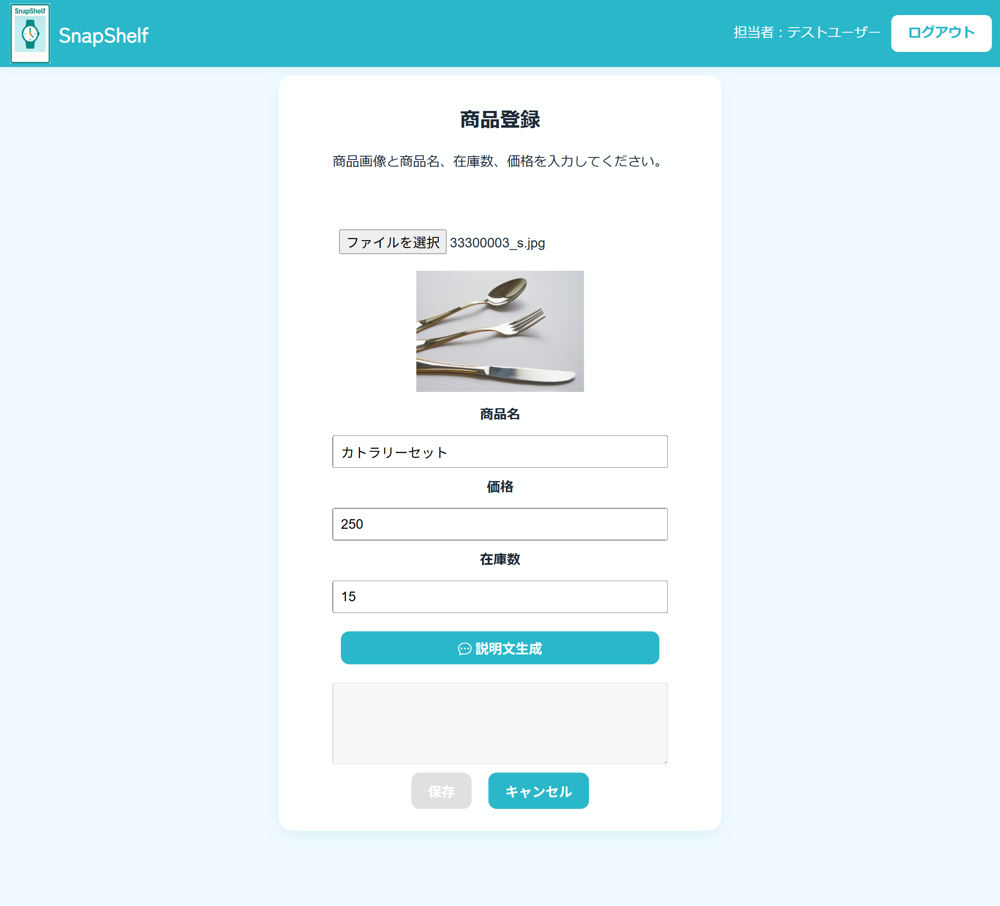
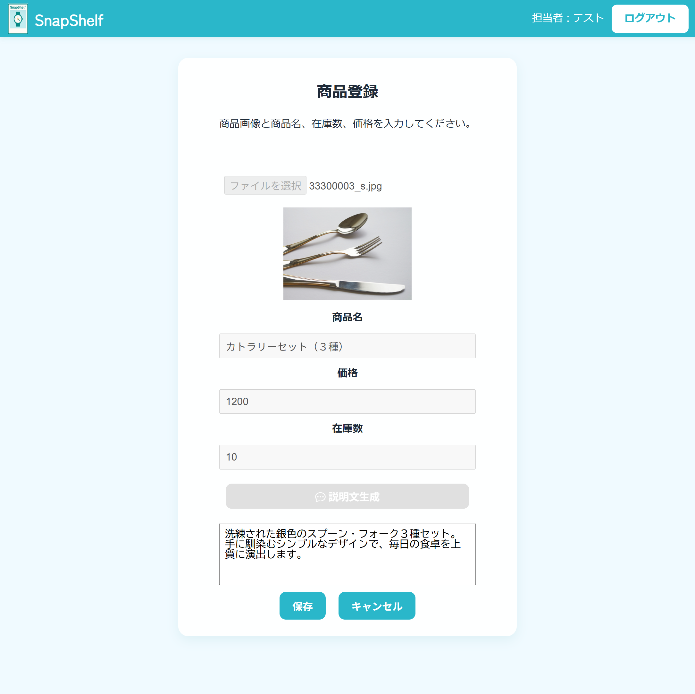

# SnapShelf 📸✨
Smart product management with auto-generated tags and descriptions.

## 📝 概要
個人学習用の Spring Boot Web アプリケーション。
商品画像を登録すると AI が自動でタグを抽出し、説明文を生成する商品管理システムです。

Google Vision API で画像解析、Gemini API で説明文生成を実装し、Render へデプロイ済みです。
カテゴリ管理機能・入出庫管理機能を実装中です。

## デモ
Renderの無料プランが終了したため、再度デプロイ予定です。

## 📷スクリーンショット

**ログイン画面**

**ホーム画面**

**商品登録画面**

**説明文生成デモ** （差し替え予定）

Vision API でタグを抽出後、Gemini API で説明文を自動生成します。

**生成された説明文**

**商品一覧画面** （差し替え予定）

## ✨ 実装済み機能
- ✅ ユーザー登録・ログイン（Spring Security）
- ✅ 商品情報の登録・一覧表示、検索・編集・保存
- ✅ Spring Data JPA によるデータベース操作
- ✅ Thymeleaf による画面表示
- ✅ Vue.js による部分的な動的処理
- ✅ Renderへのデプロイ
- ✅ Google Vision API による画像解析・タグ自動生成
- ✅ Gemini API による商品説明文の自動生成

## 🚧 開発予定
- ⏳ AWS (EC2 + RDS) へのデプロイ
- ⏳ カテゴリによる商品分類・入出庫管理機能

## 🛠️ 使用技術

**バックエンド**
- Java 17
- Spring Boot 3.5.3
- Spring Security / Spring MVC / Spring Data JPA
- Thymeleaf
- Maven（ビルド・依存管理）

**データベース**
- PostgreSQL

**フロントエンド**
- HTML / CSS
- JavaScript
- Vue.js（一部導入）

**外部API**
- Google Vision API（画像解析・タグ抽出）
- Gemini API（説明文生成）

**その他**
- Git / GitHub / GitHub Desktop
- Eclipse → 9月に STS に変更

## 📚 開発履歴
- **2025年5月**
Java学習を開始。
- 開発環境構築（Eclipse, Git, GitHub Desktop, Maven）
- データベースはまだ未導入
- 基本的な開発手順や CRUD 作成方法を試して学習
- Spring Boot の基礎を習得

- **2025年7月**
趣味開発として *popoalbum* を開始（画像投稿・表示が中心の小規模Webアプリ）。
- 画像アップロード／表示の実装
- 初期の画面・ルーティング設計

- **2025年7月下旬〜8月**
アプリを拡張し本格開発へ。
- PostgreSQL 接続・DB 設計（商品・ユーザーなど）
- ユーザー新規登録・認証画面の実装
- 画像アップロードの品質改善

- **2025年9月（リファクタリング → 改名）**
新しいPCで開発環境を再構築（STS に移行）
Java Silver SE17 を取得。
大規模リファクタリングを行い、プロジェクト名を *SnapShelf* に変更。
主な改善：
- PRG（Post-Redirect-Get）パターン導入による投稿フロー改善
- Service 層分離、例外処理整備
- Spring Security によるログイン認証／初回ログインチュートリアル分岐
- Vue.js 試験導入（動的 UI、フロント → DTO の連携修正）
- 商品一覧に検索・ページングを追加、一覧 → 詳細遷移
- 説明文自動生成（AI連携の土台）の実装準備
- UI改善・バグ修正（画像表示、フォームバリデーションなど）

- **2025年10月**
Renderへのデプロイを行い、AI連携機能を実装。
- 商品編集・削除機能の実装
- Dockerfileを使用してRenderへデプロイ
- Google Vision APIによるタグ抽出機能の完成
- Gemini APIによる説明文自動生成を実装

## 👤 作者
GitHub: [@poposay](https://github.com/poposay)

## 📄 ライセンス
This project is licensed under the MIT License.
